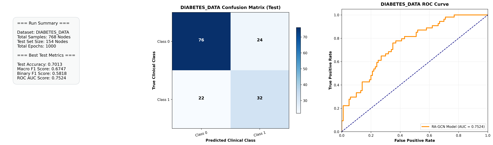
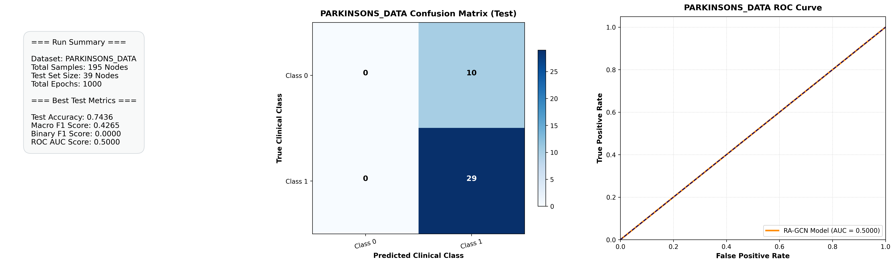
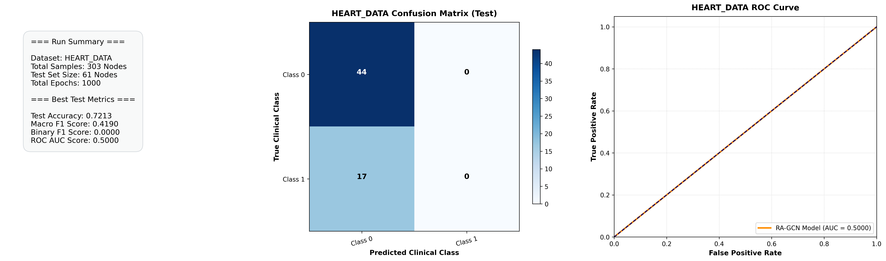
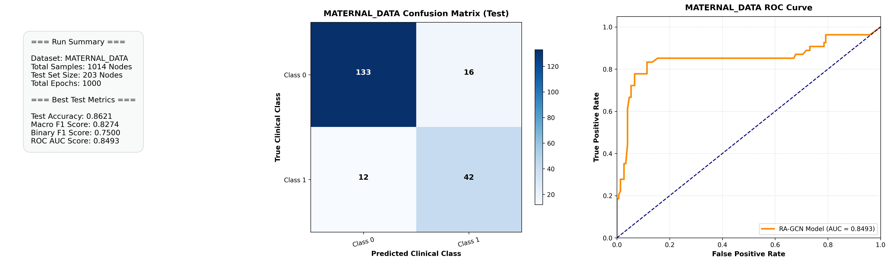
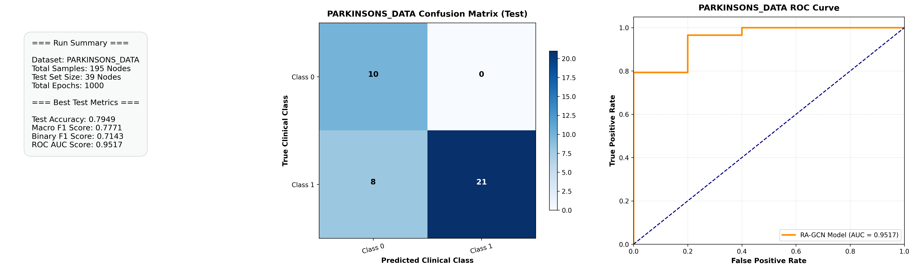

# Evaluation and Imbalance Stress-Testing of RA-GCN

This repository contains an independent extension and benchmarking suite built around **RA-GCN** (Graph Convolutional Network for disease prediction problems with imbalanced data).

## Credits & References
The core model architecture and execution layer foundations are derived from the original implementation by the authors:
* **Core Paper:** [Ghorbani, Mahsa, et al. "RA-GCN: Graph convolutional network for disease prediction problems with imbalanced data." *Medical Image Analysis* 75 (2022): 102272.](https://arxiv.org/pdf/2103.00221)
* **Underlying GCN Architecture:** [Kipf & Welling, "Semi-Supervised Classification with Graph Convolutional Networks," *ICLR* 2017.](https://arxiv.org/abs/1609.02907)

```bibtex
@article{ghorbani2022ra,
  title={Ra-gcn: Graph convolutional network for disease prediction problems with imbalanced data},
  author={ghorbani, Mahsa and Kazi, Anees and Baghshah, Mahdieh Soleymani and Rabiee, Hamid R and Navab, Nassir},
  journal={Medical Image Analysis},
  volume={75},
  pages={102272},
  year={2022},
  publisher={Elsevier}
}
```

---

## Benchmarking Extensions (This Framework)
While the original paper evaluated RA-GCN's class-imbalance mitigation claims using a mix of synthetic variables and specific clinical instances (Pima Diabetes, PPMI, Haberman), this fork introduces an expanded evaluation framework. 

We systematically stress-test the model against **five diverse, real-world clinical datasets** to analyze performance thresholds—specifically focusing on features scaling boundaries and raw topological sizes that were not highlighted in the original publication.

### Key Framework Extensions:
1. **Multi-Disease Pipeline Scaling:** Ported and evaluated the core RA-GCN architecture completely across 5 independent real-world medical tasks (OASIS, Diabetes, Parkinson's, Heart Disease, and Maternal Health Risk).
2. **SMOTE-Boosted Traditional Controls:** Implemented an automated baseline challenge featuring 5 standard statistical classifiers (Decision Tree, Random Forest, KNN, Logistic Regression, and ANN).
3. **Data-Level vs. Algorithmic-Level Balancing:** All traditional baselines are coupled with **SMOTE (Synthetic Minority Over-sampling Technique)** to act as a robust control layer, allowing direct comparison between data-level upsampling techniques and RA-GCN's embedded weighting sub-networks.
4. **Automated Analytical Dashboards:** Programmed an evaluation pipeline that auto-generates 3-panel publication-ready charts (tracking training loss convergence, active confusion matrices, and standalone traditional ROC comparison curves) for every track. All output artifacts are isolated dynamically with unique execution micro-timestamps.
5. **Automated Dimensionality Intervention:** Integrated a hardware-aware PCA scaling module within the data management layers to auto-intercept and compress noisy, high-dimensional patient vectors before topological projection.

---

## Multi-Disease Scaling & Benchmarking Framework

### Geometric Patient Network Graph Construction
Because raw clinical data arrays are published as flat spreadsheets rather than pre-assembled graphs, a graph topology converter pipeline was introduced. For every individual clinical cohort, continuous and categorical patient metrics are isolate-scaled, and structural connections (edges) are drawn between patient pairs by computing their pairwise **Cosine Similarity**:

$$S_C(\mathbf{u}, \mathbf{v}) = \frac{\mathbf{u} \cdot \mathbf{v}}{\|\mathbf{u}\| \|\mathbf{v}\|}$$

Connections are established wherever $S_C \ge \theta$ (where $\theta$ represents the optimized similarity threshold designed to maintain neighborhood graph integrity across varying clinical distributions). Self-loops are excluded from raw graph exports to allow `utils.py` to naturally inject normalized identity transformations during execution.

---

### Expanded Cohort Structural Breakdowns

| Disease Track | Target Domain Condition | Node Count (Patients) | Extracted Clinical Features | Active Graph Edge Count |
| :--- | :--- | :---: | :---: | :---: |
| **OASIS** | Alzheimer's Dementia | 303 | 7 | 2,752 |
| **Diabetes** | Pima Indian Diabetes Risk | 768 | 8 | 5,796 |
| **Parkinson's** | Vocal / Speech Dysarthria | 195 | 22 | 460 |
| **Heart Disease** | Cardiovascular Abnormality | 303 | 13 | 760 |
| **Maternal Health** | Pregnancy Risk Severity | 1,014 | 6 | 27,003 |

---

### Master Benchmarking Evaluation Metrics (Pre-PCA Legacies)

The sequential master orchestration suite executed RA-GCN side-by-side against five traditional baseline statistical classifiers (Decision Tree, Random Forest, KNN, Logistic Regression, and ANN) to observe performance variations across diverse sample dimensions. This section preserves the legacy run parameters where high-dimensional feature spaces collapsed into the majority class.

#### 1. Diabetes Experiment
- **Dataset File:** `data/diabetes/diabetes_data.pkl`
- **Dashboards & Visualizations:** `results_dashboard/diabetes_data_evaluation_dashboard.png`, `results_dashboard/diabetes_data_traditional_roc_smote.png`



#### 2. Parkinson's Disease Experiment (Legacy Dimensional Collapse)
- **Dataset File:** `data/parkinsons/parkinsons_data.pkl`
- **Dashboards & Visualizations:** `results_dashboard/parkinsons_data_evaluation_dashboard.png`, `results_dashboard/parkinsons_data_traditional_roc_smote.png`



#### 3. Heart Disease Experiment (Legacy Dimensional Collapse)
- **Dataset File:** `data/heart/heart_data.pkl`
- **Dashboards & Visualizations:** `results_dashboard/heart_data_evaluation_dashboard.png`, `results_dashboard/heart_data_traditional_roc_smote.png`



#### 4. Large-Scale Maternal Health Risk Experiment
- **Dataset File:** `data/maternal/maternal_data.pkl`
- **Dashboards & Visualizations:** `results_dashboard/maternal_data_evaluation_dashboard.png`, `results_dashboard/maternal_data_traditional_roc_smote.png`




---

## PCA Feature Engineering & Resolution Enhancements

To counter the majority class performance collapse observed on high-dimensional data matrices (such as Parkinson's Disease with 22 features and Heart Disease with 13 features), an automated dimensional mitigation phase was introduced into `code/utils.py`. When feature spaces larger than 10 dimensions are caught, features are standardized via unit variance scaling and projected into a $5$-component principal space. 

This process successfully filtered out high-dimensional noise, retaining crucial variance and raising neighborhood graph alignment scores.

### Dynamic PCA Feature Evolution Dashboard

#### 1. Parkinson's Disease Pipeline (PCA Optimized)
* **Variance Retained:** $88.30\%$
* **Core Active Metric Breakthroughs:**
  - **Test Accuracy:** `0.7949`
  - **Test Macro F1:** `0.7771`
  - **Test ROC-AUC:** `0.9517`
* **Artifact Tracking Paths:**
  - *Evaluation Panel:* `results_dashboard/parkinsons_data_evaluation_dashboard_20260617_085745.png`
  - *Baseline Plot:* `results_dashboard/parkinsons_data_traditional_roc_smote_202606dd_085753.png`



#### 2. Heart Disease Pipeline (PCA Optimized)
* **Variance Retained:** $60.27\%$
* **Core Active Metric Breakthroughs:**
  - **Test Accuracy:** `0.8197`
  - **Test Macro F1:** `0.7866`
  - **Test ROC-AUC:** `0.9158`
* **Artifact Tracking Paths:**
  - *Evaluation Panel:* `results_dashboard/heart_data_evaluation_dashboard_20260617_085838.png`
  - *Baseline Plot:* `results_dashboard/heart_data_traditional_roc_smote_202606dd_085847.png`


#### 3. Low-Dimensional Cohort Stability Validation
Low-dimensional tracks automatically bypassed the PCA compression block, retaining their full feature space and confirming execution safety boundaries:
* **OASIS Dementia Track:** Test Accuracy: `0.8800` | Macro F1: `0.8768` | ROC-AUC: `0.9188`
  - *Dashboard Asset:* `results_dashboard/oasis_data_evaluation_dashboard_20260617_085548.png`
* **Maternal Risk Track:** Test Accuracy: `0.8621` | Macro F1: `0.8274` | ROC-AUC: `0.8493`
  - *Dashboard Asset:* `results_dashboard/maternal_data_evaluation_dashboard_20260617_085948.png`
